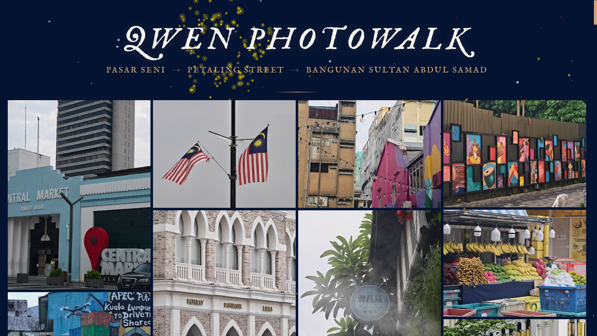

# 📸 Qwen Photowalk: KL Heritage Gallery

A live, immersive photo gallery website built during the **Qwen Photowalk** creative sprint in Kuala Lumpur. This project showcases original photography captured along the historic route of **Pasar Seni → Petaling Street → Bangunan Sultan Abdul Samad**, transformed into a cinematic, interactive web experience.

## ✨ Features
- **Responsive Mosaic Layout**: A fluid, CSS-column-based grid that adapts beautifully to mobile, tablet, and desktop screens.
- **Immersive Full-Screen Slideshow**: Features autoplay, smooth crossfade transitions, keyboard/touch navigation, and dynamic metadata overlays.
- **Real-time EXIF Extraction**: Automatically reads and elegantly formats the original capture date and time directly from the image files using `exif-js`.
- **Dynamic Canvas Animations**: Subtle, atmospheric background effects (snowflakes and fireworks) rendered in real-time via the HTML5 Canvas API.
- **Hari Merdeka Countdown**: A live, ticking countdown timer celebrating Malaysia's Independence Day (31 August).
- **Modern CSS Architecture**: Fluid typography and spacing using `clamp()`, custom scrollbars, and elegant hover states.
- **Zero-Build Setup**: Pure HTML, CSS, and Vanilla JavaScript. No frameworks, bundlers, or complex build tools required.

## 🛠️ Tech Stack
- **Frontend**: HTML5, CSS3, Vanilla JavaScript (ES6+)
- **Libraries**: `exif-js` (metadata extraction), Font Awesome 6 (icons)
- **Typography**: Google Fonts (`IM Fell English`, `Playfair Display`, `Cormorant Garamond`)
- **Assets**: Direct Google Drive image hosting, HTML5 Canvas API

## 📂 Project Structure
```text
qwen-photowalk/
├── index.html          # Main structure, canvas layer, and slideshow markup
├── style.css           # Responsive mosaic layout, fluid typography, and animations
├── script.js           # EXIF extraction, slideshow logic, canvas effects, and countdown
├── preview.png         # Website preview/screenshot displayed in this README
└── favicon.png         # Site icon
```

## 🙌 Acknowledgments
Built with ❤️ during the Qwen Photowalk creative sprint in KL/PJ.

Shot on: Honor Magic8 Pro | Powered by: Qwen3.7-Plus

A huge thank you to the organizers and the vibrant creative/tech community for the inspiration, coffee, and collaborative vibe.



> Captured at Pasar Seni, Petaling Street, and Bangunan Sultan Abdul Samad, Kuala Lumpur.